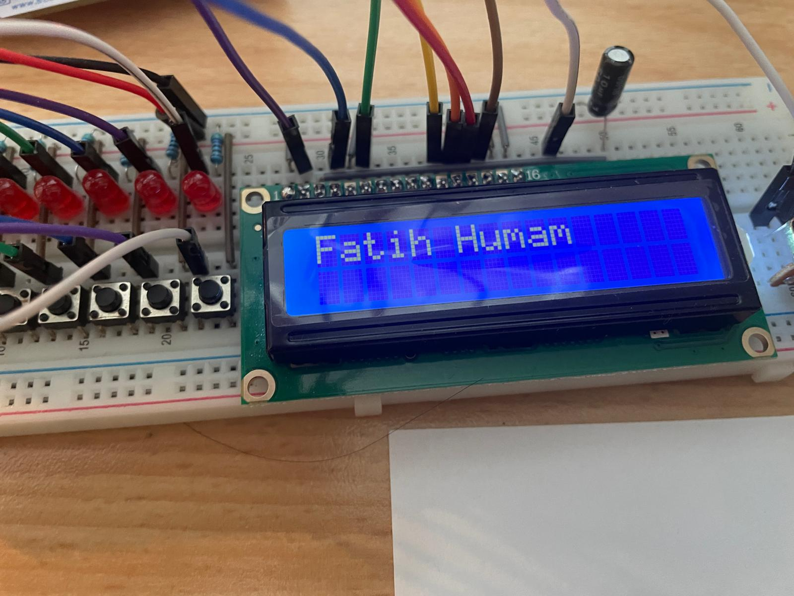

# CLcd1602 - 16x2 LCD Controller

## Overview
The `CLcd1602` class is designed to interface with a 16x2 LCD (Liquid Crystal Display) using GPIO pins. It provides an abstraction layer for controlling the LCD, sending data, setting the cursor, and writing text to the display. This class works with GPIO pins and buses to interact with the LCD.

## Features
- Control a 16x2 LCD display with basic operations.
- Set the cursor position on the LCD (supports 2 rows).
- Write both `C-style strings` and `std::string` to the display.
- Easy initialization and configuration of the LCD via GPIO pins.

## Class Description

### CLcd1602
This class encapsulates the logic required to interface with the 16x2 LCD display. It uses GPIO pins for control (`RS` and `Enable`) and a GPIO bus for the data lines.

### Private Members
- `CGpioPin* m_rs`: Pointer to the GPIO pin connected to the RS pin of the LCD.
- `CGpioPin* m_enable`: Pointer to the GPIO pin connected to the Enable pin of the LCD.
- `CGpioBus* m_data`: Pointer to the GPIO bus connected to the Data pin of the LCD.

### Public Methods
- **`CLcd1602(CGpioPin* rs, CGpioPin* enable, CGpioBus* data)`**: Constructor that initializes the LCD with the GPIO pins for RS, Enable, and Data.
  
- **`void init()`**: Initializes the LCD by configuring the necessary settings.
  
- **`void write(const char* text)`**: Writes a `C-style` string to the LCD display.
  
- **`void write(const std::string& text)`**: Writes a `std::string` to the LCD display.
  
- **`void setCursor(int row, int column)`**: Sets the position of the cursor on the LCD to a specific row and column.
  
### Private Methods
- **`void writeNibble(uint8_t rs, uint8_t data)`**: Writes a 4-bit nibble to the LCD.
  
- **`void writeByte(uint8_t rs, uint8_t data)`**: Writes 8 bits to the LCD by first sending the higher-order 4 bits, then the lower-order 4 bits.

## Installation

### Prerequisites
- STM32 development environment (e.g., STM32CubeIDE).
- Compatible 16x2 LCD display.
- GPIO pins configured for RS, Enable, and Data.
- `CGpioPin` and `CGpioBus` classes to handle GPIO operations (from your project).

### Steps
1. Clone this repository and include the `CLcd1602.h` and `CLcd1602.cpp` files in your project.
2. Make sure you have configured the `CGpioPin` and `CGpioBus` classes to handle GPIO interactions.
3. Include the `CLcd1602` class in your main application code.

## Picture
